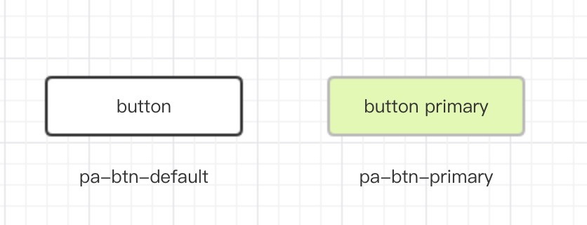
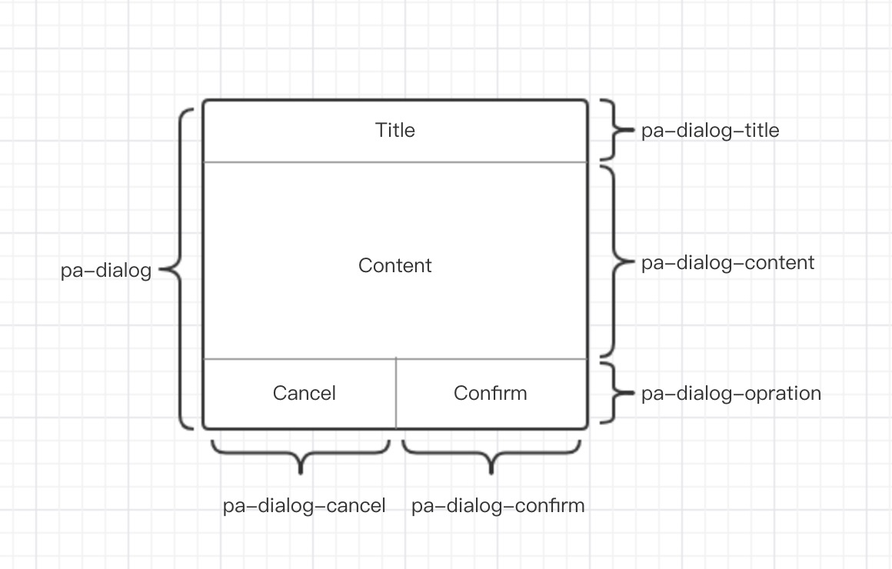
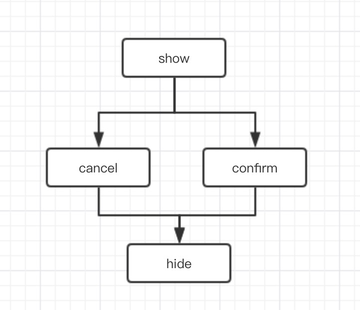

本节将从 `命名规范` 和 `设计规范` 两个方面来描述组件的开发规范

# 命名规范

## 底是 Component 还是 Widget

### Component

发音： [kəm'ponənt]

释义：组成部件

### Widget

发音：['wɪdʒɪt] 

释义：装饰部件

那这两个术语到底有什么区别呢？

从语义上看，`Component` 指的是一个物体的组成部分，`Widget` 则是对一个独立物体的修饰，意义在于在该物体更完美。

举个例子，一辆车，他是由 `车轮`，`车体`，`发动机` 等部件组成，那么 `车轮`，`车体`，`发动机` 就可以称为 `Component`，同时我们也会在车体上粘贴一些车饰布偶等小挂件，这些布偶小挂件就被称为 `Widget`.

对应到 Web 页面中，页面中的 navigator，button, swiper, slider 等等都属于页面的组成部分，所以这些都应该被称作 `Component`, 而页面中的客服入口，广告等用来提升产品体验，收入等页面挂件，他不是页面的必要组成部分，属于锦上添花的部分，就称为 `Widget`.

## 组件名

每个组件必须使用首字符大写的驼峰命名法来定义组件名，组件名不需要命名空间。

这里使用弹窗组件来作为本文的例子，那符合本文规范的命令方式是 `Dialog`, 不推荐的做法是 `xxx-Dialog`，其中 `xxx` 可能是组织或者公司的名称。

## 样式类名

样式名使用全小写的命名方式，单词间使用 `-` 作为分隔符，推荐类名添加组织或者公司名称或者缩写作为命名空间，虽然在实践中可以使用 `scope` 来避免命名冲突导致的样式覆盖，出于方便区分自定类与组件内部类，推荐添加命名空间作为类名前缀，命名空间与类名之间使用 `-` 作为分割。

这里以 button 为示例，如下图：



默认样式的按钮和基础样式的按钮，pa-btn-default, pa-btn-primary

其中 `pa-btn` 就是按钮所有样式的前缀，由组织 pandolajs 缩写 `pa` 和按钮名称 button 缩写 `btn` 组成，使用 `-` 进行分割。

不同的状态或者类型，如上例 `default`, `primary` 与前缀进行拼接，同样使用 `-` 进行分割。

在 less 中可以按照以下格式进行开发。

```
  .pa-btn {
    display: inline-block;
    padding: 8px 40px;
    border: 1px solid #ededed;
    border-radius: 10px;

    &-default {
      background: transparent;
    }

    &-primary {
      background: lightgreen;
    }
  }
```

# 设计规范

每个组件，除了命名规范要统一之外，更重要的应该是具备统一分设计风格，本节使用 Dialog 为例，从结构设计，样式，交互三个方面进行设计规范说明。

组件存在的目的之一就是提高代码的复用度，设计良好的组件才能最大限度的覆盖使用场景，也只有覆盖足够多的场景，才能将组件的复用度最大化。

组件复用又可以从两个方面去思考，结构的复用，功能的复用。参考下图，以 Dialog 设计为例，一一分析。



## 结构设计

为了提高组件的通用性，在设计组件结构的时候，我们要遵守组件固有的功能，只提供组件应有的关键节点，所以通用组件应该是重功能而轻样式，当然组件的开发者可以提供一套默认的样式，但是默认的样式也应该尽量保持组件关键节点的简洁性，尽量不要增加额外的样式节点（非关键节点，只为满足某种样式需求而增加的节点），如果不可避免的需要样式节点，我们也要尽可能的不去影响关键节点的流动性，为使用者提供足够原生也符合使用者预期的扩展能力。

如本节开头的 Dialog 组件，结构设计如下：

```
  <div class="pa-dialog">
    <div class="pa-dialog-title">Title</div>
    <div class="pa-dialog-content">Content</div>
    <div class="pa-dialog-opration">
      <a href="javascript:;" class="pa-dialog-cancel">Cancel</a>
      <a href="javascript:;" class="pa-dialog-confirm">Confirm</a>
    </div>
  </div>
```

## 样式设计

在为组件的关键节点提供默认样式的时候，我们要尽量保持该节点元素的流动性，保证元素块的原生行为。如：在关键节点上使用绝对/固定定位，`position: absolute | flex;` 或者使用定宽定高，`width: 100px; height: 50px;` 等等 ~~ 如果考虑不周，会导致使用者提供自定义节点（slot）时出现不符合预期的表现。

同时我们应该为使用者提供每个关键节点的调用句柄，方便用户自定义样式。

如上上述 Dialog 组件，结构数据修改如下：

```
  <div role="pa-dialog" class="pa-dialog">
    <div role="pa-dialog-title" class="pa-dialog-title">Title</div>
    <div role="pa-dialog-content" class="pa-dialog-content">Content</div>
    <div role="pa-dialog-opration" class="pa-dialog-opration">
      <a role="pa-dialog-cancel" href="javascript:;" class="pa-dialog-cancel">Cancel</a>
      <a role="pa-dialog-confirm" href="javascript:;" class="pa-dialog-confirm">Confirm</a>
    </div>
  </div>
```

> 这里为每个关键节点提供了 `role` 属性，作为样式自定义的句柄，不直接使用 class 是考虑到 `scope` 的支持.

样式部分：

我们要避免在组件默认样式中为 `pa-dialog-title` 和 `pa-dialog-content` 等提供 `height: xxxpx` 这样破坏元素流动性的代码（在遵守基本原则的前提下，根据实际情况灵活运用）。

## 交互设计

每个组件有具备自己完成的生命周期，为了能尽可能多的满足业务场景，我们需要为组件的每个生命周期提供 hook method 或者对外广播事件，同时为了方便控制组件，应该提供复合语义的 api。

如上 Dialog 的生命周期如下图：



所以 Dialog 组件应该具备如下 lifecircle hook methods

`onShow`, `onConfirm`, `onCancel`, `onHide`

同时也需要为 Dialog 实例提供 `this.close()` 和 `this.show()` 方法